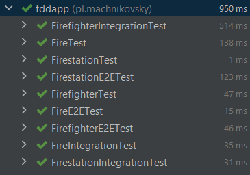

In that project I'm trying to make little Firefighter system with three basic entities - Firefighter, Firestation and Fire. There's also additional enum - Rank, and it's an attribute of Firefighter. The main goal of this project is to build it according to TDD approach, BDD specifically (given/when/then). I'm also trying to write three different types of tests - Unit Tests, Integration Tests, E2E Tests. The core project is written in Spring and I'm using JUnit and Mockito for test purposes, but I'm going to add PostgreSQL databses for later tests.

## Unit tests

Insise Unit Tests I focused on veryfing that logic and functionality works fine. I tested service layer or both service and repository layers, whether they communicate well and return expected results. I also tested edge cases. 


- FirefighterTest
```
@ExtendWith(MockitoExtension.class)
class FirefighterTest {


    private FirefighterService firefighterService;
    private FirefighterRepository firefighterRepository;


    @BeforeEach
    void init() {
        firefighterRepository = mock(FirefighterRepository.class);
        firefighterService = new FirefighterService(firefighterRepository);
    }

.............
Actual tests
.............

}
```


- FirestationTest
```
@ExtendWith(MockitoExtension.class)
class FirestationTest {

    private FirestationService firestationService;
    private FirestationRepository firestationRepository;

    @BeforeEach
    void init() {
        firestationRepository = mock(FirestationRepository.class);
        firestationService = new FirestationService(firestationRepository);
    }

.............
Actual tests
.............

}
```


- FireTest
```
@ExtendWith(MockitoExtension.class)
class FireTest {

    private FireService fireService;
    private FireRepository fireRepository;
    private FirestationRepository firestationRepository;

    @BeforeEach
    void init() {
        firestationRepository = mock(FirestationRepository.class);
        fireRepository = mock(FireRepository.class);
        fireService = new FireService(fireRepository, firestationRepository);
    }

.............
Actual tests
.............

}
```


- MockLists - that class provides mocked lists of various objects used in other test classes.
```
class MockLists {

    public static List<Firefighter> mockListOfFirefighters() {...}

    public static List<Firestation> mockListOfFirestations() {...}

    public static List<Fire> mockListOfFires() {...}

}
```


## Integration tests


Inside integration tests I checked whether connection to database works fine, if I can get certain values, add new records to database, remove them, and also if he logic itself works fine. For the purposes of these tests I also created two profiles - "test" and "prod" with two different application.properties files. Each profiles has a different database, so that tests doesn't do any harm to actual databse.


- FirefighterIntegrationTest
```
@SpringBootTest
@AutoConfigureMockMvc
@ActiveProfiles("test")
class FirefighterIntegrationTest {

    @Autowired
    private MockMvc mockMvc;

    @Autowired
    ObjectMapper objectMapper;

    @Test
    public void shouldReturnAllFirefighters() throws Exception {...}

    @Test
    public void shouldReturn404() throws Exception {...}

    @Test
    public void shouldReturnCertainFirefighter() throws Exception {...}

    @Test
    public void shouldAddAndRemoveNewFirefighter() throws Exception {...}

}
```


- FirestationsIntegrationTest
```
@SpringBootTest
@AutoConfigureMockMvc
@ActiveProfiles("test")
public class FirestationIntegrationTest {

    @Autowired
    MockMvc mockMvc;

    @Autowired
    ObjectMapper objectMapper;

    @Test
    public void shouldReturnAllFirestations() throws Exception {...}

    @Test
    public void shouldReturnFirestationsWithMoreThanSomeNumberFirefighters() throws Exception {...}

    @Test
    public void shouldReturnFirestationsFromCertainCity() throws Exception {...}
}
```


- FireIntegrationTest
```
@SpringBootTest
@AutoConfigureMockMvc
@ActiveProfiles("test")
public class FireIntegrationTest {

    @Autowired
    MockMvc mockMvc;

    @Autowired
    ObjectMapper objectMapper;

    @Test
    public void shouldReturnAllFires() throws Exception {...}

    @Test
    public void shouldReturnFiresWithCertainDanger() throws Exception {...}

    @Test
    public void shouldReturnFiresWithAtLeastCertainDanger() throws Exception {...}

}
```


- Mocked values - to make tests possible I mocked the values into repositories by injecting them at the start of application

```
    @EventListener(ApplicationReadyEvent.class)
    public void init() {
        firefighterRepository.saveAll(firefighters);
        firestationRepository.saveAll(firestations);
        fireRepository.saveAll(fires);
    }
```


## E2E tests


Inside E2E tests I simulate entering certain endpoints by client. I can't do that specifically, because my application doesn't have FrontEnd, but I can access these endpoints and check whether everything works as it should, the whole functionality, integration and working of http is tested here. Here I use random port, so I can test whether it works as it should on any port. I also run the whole Spring Context. I use mocked values from integration tests.

- FirefighterE2ETest
```
@SpringBootTest(webEnvironment = SpringBootTest.WebEnvironment.RANDOM_PORT)
@ActiveProfiles("test")
public class FirefighterE2ETest {

    @LocalServerPort
    private int port;

    @Autowired
    TestRestTemplate testRestTemplate;

    @Test
    public void shouldReturnAllFirefighters() {...}

    @Test
    public void shouldReturnBestFirefighter() {...}

    @Test
    public void shouldReturnFirefighterNotFoundException() {...}
}
```

- FirestationE2ETest
```
@SpringBootTest(webEnvironment = SpringBootTest.WebEnvironment.RANDOM_PORT)
@ActiveProfiles("test")
public class FirestationE2ETest {

    @LocalServerPort
    private int port;

    @Autowired
    TestRestTemplate testRestTemplate;

    @Test
    public void shouldReturnAllFirestations() {...}

    @Test
    public void shouldReturnFirestationsFromCertainCity() {...}

    @Test
    public void shouldReturnFirestationsWithCertainNumberOfFirefighters() {...}
}
```

- FireE2ETest
```
@SpringBootTest(webEnvironment = SpringBootTest.WebEnvironment.RANDOM_PORT)
@ActiveProfiles("test")
public class FireE2ETest {

    @LocalServerPort
    private int port;

    @Autowired
    TestRestTemplate testRestTemplate;

    @Autowired
    ObjectMapper objectMapper;

    @Test
    public void shouldReturnAllFires() {...}

    @Test
    public void shouldReturnAllActiveFires() {...}

    @Test
    public void shouldReturnFiresWithDangerAtLeast() {...}
}
```



